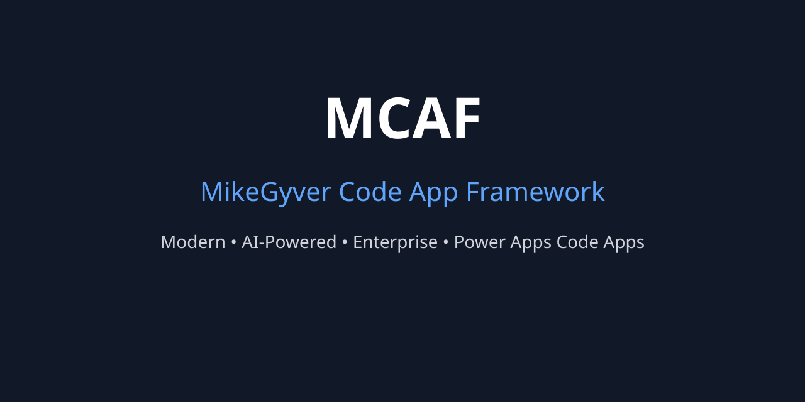

  

<h1 align="center">MCAF</h1>

<b>MikeGyver Code App Framework</b> 
The open-source ecosystem for building modern, AI-powered Microsoft Power Apps Code Apps.

---

## What is MCAF?

MCAF (MikeGyver Code App Framework) is an open-source ecosystem that simplifies building enterprise-grade Microsoft Power Apps Code Apps. It combines a reusable application framework, provider-neutral AI services, and production-ready reference applications to accelerate development while promoting clean architecture and reusable design patterns.

Whether you're building internal business tools, enterprise solutions, or AI-assisted applications, MCAF provides a consistent foundation for modern Code App development.

---

## Ecosystem

| Repository | Purpose |
|------------|---------|
| **[mcaf-sdk](https://github.com/ekim5sg/mcaf-sdk)** | Reusable application framework, UI components, plugins, metadata-driven forms, and developer tools. |
| **[mcaf-intelligence](https://github.com/ekim5sg/mcaf-intelligence)** | Provider-neutral AI gateway with Cloudflare Workers AI, prompt management, telemetry, health monitoring, and intelligence services. |
| **[mcaf-samples](https://github.com/ekim5sg/mcaf-samples)** | Complete reference applications demonstrating architecture, best practices, and real-world implementations built with MCAF. |

---

## Core Principles

MCAF is designed around a small set of guiding principles:

- Reusable UI components
- Metadata-driven application development
- Plugin-based extensibility
- Provider-neutral AI integration
- Enterprise-ready architecture
- Clean separation of presentation, business logic, and services
- Modern TypeScript development practices
- Cloud-native intelligence services

---

## Why MCAF?

MCAF helps developers spend less time building infrastructure and more time building solutions.

It provides:

- Faster application development
- Consistent architecture across projects
- Reusable components and patterns
- Simplified AI integration
- Production-ready development practices
- A growing open-source ecosystem

---

## Getting Started

1. Clone **mcaf-sdk** to build your application foundation.
2. Deploy **mcaf-intelligence** to enable AI-powered capabilities.
3. Explore **mcaf-samples** to learn recommended architecture and implementation patterns.

---

## Roadmap

Current areas of investment include:

- Expanded UI component library
- Additional AI providers
- Visual designers
- Plugin marketplace
- Documentation and tutorials
- Enterprise templates
- Community contributions

---

## Contributing

Contributions, suggestions, feature requests, and pull requests are welcome.

If you'd like to help shape the future of MCAF, please review the **Contributing Guide** and open an issue to start the discussion.

---

## Join the Journey

MCAF is an evolving open-source ecosystem focused on making Microsoft Power Apps Code App development more modular, reusable, and AI-ready.

If you're interested in contributing, experimenting, or providing feedback, we'd love to hear from you.

---

## License

This project is licensed under the [MIT License](LICENSE).
